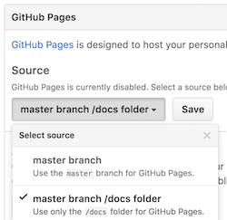

# es2015-browserapp-minimum-boilerplate

This is the minimum of the boiler plate to create an application for the browser in the ES2015.

## Demo

https://hkusu.github.io/es2015-browserapp-minimum-boilerplate/

> This demo is delivered in github-pages.

## Installation

    git clone https://github.com/hkusu/es2015-browserapp-minimum-boilerplate
    npm install

## Usage

### Monitoring and automated build of source code

    npm run watch

### Start the local server

    npm run serve

### Generation of javascript file to be delivered in production

    npm run build

## Other sample

- The maximum configuration for application of applying the facebook react to view.
    - https://github.com/hkusu/react-app-example
